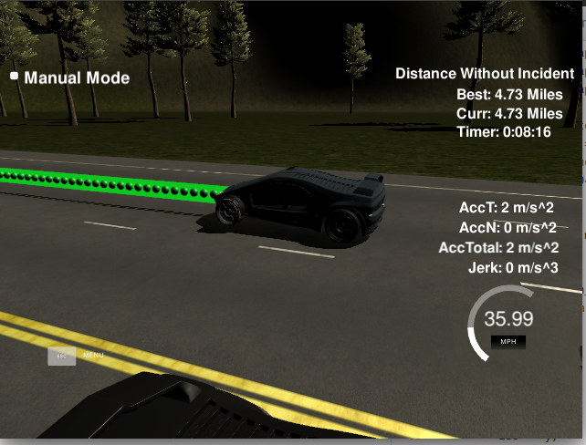

# CarND-Path-Planning-Project
Self-Driving Car Engineer Nanodegree Program




### Simulator.
You can download the Term3 Simulator which contains the Path Planning Project from the [releases tab (https://github.com/udacity/self-driving-car-sim/releases/tag/T3_v1.2).  

To run the simulator on Mac/Linux, first make the binary file executable with the following command:
```shell
sudo chmod u+x {simulator_file_name}
```

### Goals
In this project your goal is to safely navigate around a virtual highway with other traffic that is driving +-10 MPH of the 50 MPH speed limit. You will be provided the car's localization and sensor fusion data, there is also a sparse map list of waypoints around the highway. The car should try to go as close as possible to the 50 MPH speed limit, which means passing slower traffic when possible, note that other cars will try to change lanes too. The car should avoid hitting other cars at all cost as well as driving inside of the marked road lanes at all times, unless going from one lane to another. The car should be able to make one complete loop around the 6946m highway. Since the car is trying to go 50 MPH, it should take a little over 5 minutes to complete 1 loop. Also the car should not experience total acceleration over 10 m/s^2 and jerk that is greater than 10 m/s^3.


## Basic Build Instructions

1. Clone this repo.
2. Make a build directory: `mkdir build && cd build`
3. Compile: `cmake .. && make`
4. Run it: `./path_planning`.

Here is the data provided from the Simulator to the C++ Program

#### Main car's localization Data (No Noise)

["x"] The car's x position in map coordinates

["y"] The car's y position in map coordinates

["s"] The car's s position in frenet coordinates

["d"] The car's d position in frenet coordinates

["yaw"] The car's yaw angle in the map

["speed"] The car's speed in MPH

#### Previous path data given to the Planner

//Note: Return the previous list but with processed points removed, can be a nice tool to show how far along
the path has processed since last time.

["previous_path_x"] The previous list of x points previously given to the simulator

["previous_path_y"] The previous list of y points previously given to the simulator

#### Previous path's end s and d values

["end_path_s"] The previous list's last point's frenet s value

["end_path_d"] The previous list's last point's frenet d value


---

## Dependencies

* cmake >= 3.5
  * All OSes: [click here for installation instructions](https://cmake.org/install/)
* make >= 4.1
  * Linux: make is installed by default on most Linux distros
  * Mac: [install Xcode command line tools to get make](https://developer.apple.com/xcode/features/)
  * Windows: [Click here for installation instructions](http://gnuwin32.sourceforge.net/packages/make.htm)
* gcc/g++ >= 5.4
  * Linux: gcc / g++ is installed by default on most Linux distros
  * Mac: same deal as make - [install Xcode command line tools]((https://developer.apple.com/xcode/features/)
  * Windows: recommend using [MinGW](http://www.mingw.org/)
* [uWebSockets](https://github.com/uWebSockets/uWebSockets)
  * Run either `install-mac.sh` or `install-ubuntu.sh`.
  * If you install from source, checkout to commit `e94b6e1`, i.e.
    ```
    git clone https://github.com/uWebSockets/uWebSockets
    cd uWebSockets
    git checkout e94b6e1
    ```


  ## Methodology for Planning Paths.

  New way points are generated ahead of the car in the Frenet Serret Frame. There are 'n_wp' way-points spaced 30 metres apart.
```c++
//Generate n_wp sparse waypoints ahead
int n_wp = 3;
for (int i_wp = 0; i_wp < n_wp; ++i_wp ){
  vector<double> next_wp = getXY(car_s + 30*(i_wp+1), (2+4*lane), map_waypoints_s, map_waypoints_x, map_waypoints_y);
  ptsx.push_back(next_wp[0]);
  ptsy.push_back(next_wp[1]);

}
```
A coordinate trasformation then converts these back into the the frame of reference of the car where a spline is used to fit fit these waypoints for later interpolation such that the car can then follow.


```c++
// Shift and rotate to the cars reference frame
for (int i = 0; i <= ptsx.size(); i++ ){
  double shift_x = ptsx[i] - ref_x;
  double shift_y = ptsy[i] - ref_y;

  ptsx[i] = (shift_x*cos(0-ref_yaw) - shift_y*sin(0-ref_yaw));
  ptsy[i] = (shift_x*sin(0-ref_yaw) + shift_y*cos(0-ref_yaw));

}
```
###  Lane Changing and Satisfying Speed Constraints

  The car needs to drive 4.63 miles around the track without incident or collisions whilst maintaining the speed limit. Furthermore lane changes when appropriate are takes slowly and safely.

#### Maintaining SPEED

First we check to see the condition is met for being too close to the car in front by 30m, If so then the ref_vel is reduced and the change lane flag is on.
```c++
// Condition to check if you are too close to the car directly in front
too_close = check_if_too_close(sensor_fusion, current_lane, prev_size, car_s);

if(too_close)
{
  ref_vel -=.224;
}
else if(ref_vel <49.5){
  ref_vel += .224;
  change_lane = true;
}
```
The following code shows the logic for conducting a Left Maneuver and a Right Maneuver.
```c++
if (change_lane && !in_lane_change){
  if(too_close){
    bool manuver_R = ManuverRight(sensor_fusion, current_lane, prev_size, car_s);
    bool manuver_L = ManuverLeft(sensor_fusion, current_lane, prev_size, car_s);
    if(manuver_R){
      previous_lane = lane;
      lane = lane + 1;
      in_lane_change = true;
      lane_change_finished = false;
      change_lane = false;
    } else if(manuver_L){
      previous_lane = lane;
      lane = lane - 1;
      in_lane_change = true;
      lane_change_finished = false;
      change_lane = false;

    }
  }
}
```

The car moves between the following states:
- Keep lane
- Keep lane and slow down
- Keep lane and speed up
- change lane and Maneuver left
- change lane and Manuver right
- Finish lane change

### Conculsion and reflection
  The simulated car was able to traverse the track without incident. Multiple improvements can be made to the simulator. The logic for changing lanes can be greatly improved. A cost function system can be used to chose the lane with the higest value incorporating speed, smooth ride and collision avoidance. Lane changes can be made faster and smoother.
